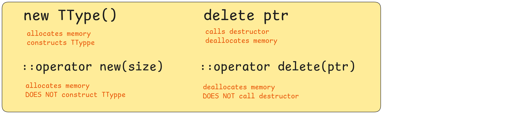
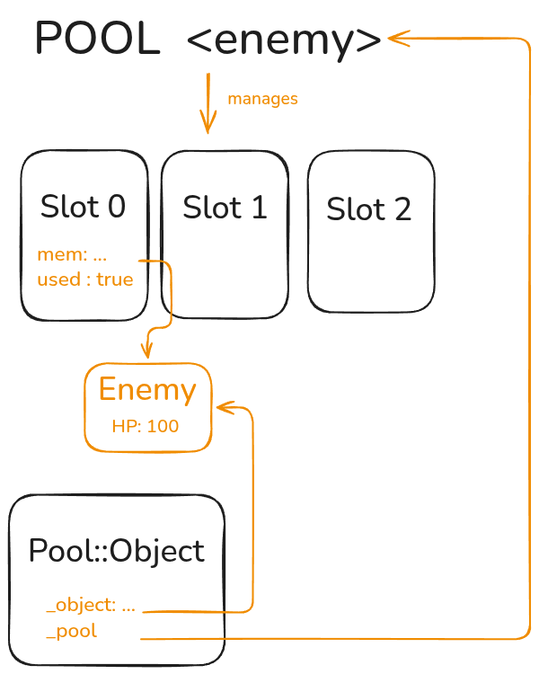
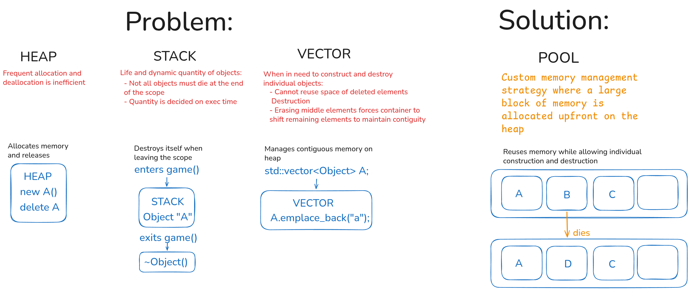

# libftpp — Advanced C++ Toolbox (42 Piscine Object)

A portable, header-plus-static-library C++ toolbox built developed as part of the 42 Piscine Object curriculum: reusable data structures, manual memory management and RAII, object oriented design & design patterns, thread-safe I/O, multithreading & synchronization, networking primitives and mathematical utilities.

The library is built as a static archive and exposed through a single header:

````
#include "libftpp.hpp"
````

## Build

Build the static library:
````
make    # produces libftpp.a (c++, -Wall -Wextra -Werror, C++17)
````
## Testing
Tests are located in `tests/` and link with `-pthread`:

````
c++ -Wall -Wextra -Werror -std=c++17 tests/*.cpp \
    structs/data_buffer.cpp patterns/memento.cpp \
    iostream/thread_safe_iostream.cpp \
    threading/thread.cpp threading/worker_pool.cpp threading/persistent_worker.cpp \
    -o test_libftpp -pthread
./test_libftpp
````

Verified clean under `valgrind` (memcheck: no leaks, no errors) and `helgrind`
(no data races).

## Sections

### 1. Data Structures (`structs/`, via `data_structures.hpp`)

- **`Pool<TType>`** (`pool.hpp` / `pool.tpp`) — fixed-capacity pool of reusable
  objects.
  Memory for each slot is raw-allocated once with `::operator new`;
    <p align="center">
      
      
    </p>
  
  - `acquire()` placement-news a `TType` into a free slot and hands out a
  move-only `Pool::Object` RAII guard whose destructor calls the `TType`
  destructor (without freeing the memory) and releases the slot back.
  - `resize()` grows by allocating raw slots and shrinks by dropping free slots,
  refusing to shrink below the live-object count.

  


- **`DataBuffer`** (`data_buffer.hpp` / `data_buffer.tpp` / `data_buffer.cpp`) —
  polymorphic byte container.
  - `operator<<` serializes any streamable type through `ostringstream` into `\0`-separated frames
  - `operator>>` walks a read cursor frame by frame and rebuilds values via `operator>>`
    
    Copyable (buffer + cursor), with `clear()` / `size()` / `empty()`


### 2. Design Patterns (`patterns/`, via `design_patterns.hpp`)

- **`Memento`** (`memento.hpp` / `memento.cpp`) — snapshot/restore base class.
  - `Snapshot` wraps a `DataBuffer`, so subclasses just stream members
  (`snapshot << hp << name`)
  - The child implements private `_saveToSnapshot` / `_loadFromSnapshot` and declares
  `friend class Memento;`
  - `load()` copies the snapshot first, so saved checkpoints stay reusable
- **`Observer<TEvent>`** (`observer.hpp` / `observer.tpp`) —
  -`map<Event,vector<function>>``subscribe()`: registers lambdas
  - `notify()` runs them (no-op on unknown events)
- **`Singleton<TType>`** (`singleton.hpp` / `singleton.tpp`) — CRTP base:
  - `instantiate(args...)` perfect-forwards the single instance (throws if set)
  - `instance()` returns it, plus a `destroy()` helper for leak-free tests
- **`StateMachine<TState>`** (`state_machine.hpp` / `state_machine.tpp`) —
  registered states, per-state actions and `(from, to)` transition lambdas
  
  *Missing transitions/actions throw; the first `transitionTo()` seeds the
  current state*

### 3. IOStream (`iostream/`)

- **`ThreadSafeIOStream`** (`thread_safe_iostream.hpp` / `.cpp`) — line-buffered,
  prefixed, thread-safe output.

  - Each thread writes through its own `threadSafeCout` (`extern thread_local`, defined once in the `.cpp` so it
  links cleanly across translation units), accumulating into a private buffer
  - Every completed line (`\n` or `std::endl`, including a manipulator overload) is flushed atomically under a shared static mutex as `prefix + line`
  - `operator>>` and `prompt(question, dest)` round out thread-safe input

### 4. Threading (`threading/`, via `threading.hpp`)

- **`ThreadSafeQueue<TType>`** (`thread_safe_queue.hpp` / `.tpp`) — header-only
  `deque` + mutex double-ended queue, popping an empty queue throws
  
- **`Thread`** (`thread.hpp` / `.cpp`) — named `std::thread` wrapper with
  deferred `start()` and joining `stop()` (destructor joins if still running)
  
*On launch it sets its `threadSafeCout` prefix to `[name] `*
- **`WorkerPool`** (`worker_pool.hpp` / `.cpp`) — perpetually-running workers
  sized to `hardware_concurrency()` pulling an internal job queue.
  
  Jobs are described by the `IJobs` interface (`execute()`), with `addJob()` wrapping
  plain functions in an internal adapter; explicit `start()` / `stop()`
  
- **`PersistentWorker`** (`persistent_worker.hpp` / `.cpp`) — one thread looping
  over a named task map (`addTask` / `removeTask`, mutex-protected, snapshot
  per round), with `start()` / `stop()` and idle sleeps instead of busy-spin.

### 5. Network & Mathematics

...
